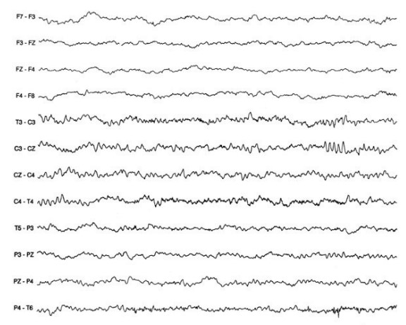

# Brain-Activity-Recognition-via-EEG-Signal-Classification
A picture of either a piano or a human was shown to 90 participants, while their EEG signals were recorded for 7 seconds. In this project we determine the moment when individuals could recognize whether the image depicts a human or a piano by segmenting the EEG 
signals over time, classifying these segments, and identifying the segment with the highest accuracy in determining the content of the picture.
 
 
__EEG Signal__:
 
The EEG signals were recorded using a 128-channel device, with a sampling rate of 500Hz, resulting in a total of 3500 samples recorded for each participant. 
With 90 participants involved in the trials, the dataset comprised dimensions of 128 channels by 3500 samples by 90 individuals. The labels assigned to the data points were either 'human' or 'piano'.
 

 
 
__Feature Extraction__:
 
Extracted features are meant to minimize the loss of important information embedded in the signal. In addition, they also simplify the amount of resources needed to describe a huge set of data accurately. A variety of methods have been widely used to extract the features from EEG signals, among these methods are time frequency distributions (TFD), fast fourier transform (FFT), eigenvector methods (EM), wavelet transform (WT), and auto regressive method (ARM).
Frequency domain methods may not provide high-quality performance for some EEG signals. In contrast, time-frequency methods, for instance, may not provide detailed information on EEG analysis as much as frequency domain methods.
 
in this project, we used the method of dividing the data into different overlapping windows, as a method for feature selection.Overlapping windows for feature extraction is a technique where a dataset is divided into consecutive segments (windows) of fixed length, with each window overlapping partially with the adjacent ones. This approach is commonly used in signal processing tasks such as feature extraction from EEG signals.
 
We have a dataset comprising 126 channels, 90 participants, and 3500 samples over time. To extract features, we employ a windowing technique with a length of 70, slides through the third dimension(time). The mean of each window is calculated, serving as the extracted features. So, the dataset is transformed into a format of 126 channels, 90 participants, and 70 time slots. Finally, we convert the features to 50 dataframes of 126*90. Each dataframe represents a time slot.
 
 
**Preprocessing:**
 
We shuffle our data frame, split it into test and train datasets , and use standardscaler and random seed on our test and train data. standardscaler moves the mean to 0 and scales the variance to 1.
 
 
**Classification:**
 
For classification, we have 3 classification models. KNN, SVM, and Neural Networks(MLP).
 
 
**Cross Validation:**
 
We use GreadsearchCV that is a (type of k-fold cross validation metode)to find the hyperparameters.
 After finding the best hyper paarameters, we train our model, evaluate the model on test data, and return test accuracy.
  
 we define a function called "Repeated_Classification". It classifies a dataframe 5 times with the selected model.

To achive better accuracy, we use 5 different random seed numbers to get  each time we use a different random seed number to classify dataframe 5 times.for each data frame, we get the mean and standard deviation of the accuracies. we return a list of accuracy means and a list of accuracy stds
 
 
**Results**:
 
We plot the mean accuracy and the standard error band: $SE=\frac{\sigma}{\sqrt{N}}$
 
N: number of samples
 
$\sigma$:	sample standard deviation
 
SE:standard error of the sample
 
so the maximum  of the band is mean+SE and the minimum of the band is mean-SE
 
we also map the number of our dataframes to time.for each dataframe, we flattend the mean of window with length of 70 samples, so for each dataframe, we convert the number of its middle sample to milliseconds:
 
the samples of the $k_{th}$ dataframe vary from $50k$ to $50k+70$,
so the middle sample index is $\frac{50k+50k+70}{2}=50k+35$, which is $\frac{7}{3500}*(50k+35)*1000=100k+70$ milliseconds

